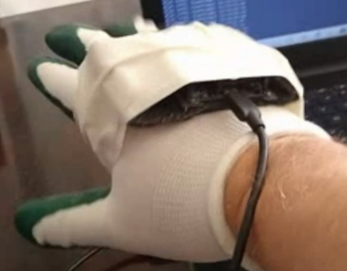
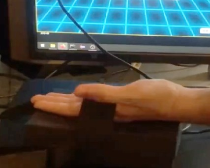
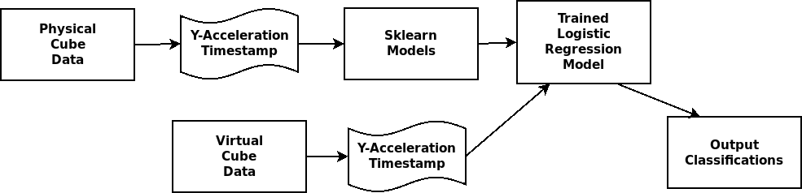

# Improving Interactions with Virtual Reality Objects in the AWS Cloud using IoT Wearable Devices

**DGMD S-14 Project - Harvard University**

Anthony Mancini (Project Lead, VR, Data Analysis)
Gregory Retter (Wearable Design, Data Collection)
Brian Wagner (Documentation)
Nawal Al-Harbi (Support)

## Table of contents
 
* **[Abstract](#abstract)**
* **[Introduction](#introduction)**
* **[Technology Components](#technology-components)**
* **[Prototype Development](#prototype-development)**
* **[Work Plan and Milestones](#work-plan-and-milestones)**
* **[Building the Machine Learning Model](#building-the-machine-learning-model)**
* **[Machine Learning Model Workflow](#machine-learning-model-workflow)**
* **[Final Product](#final-product)**
* **[Summary and Conclusions](#summary-and-conclusions)**
* **[Next Steps and Future Plans](#next-steps-and-future-plans)**
* **[Team Contributions](#team-contributions)**
* **[Project Repository](#project-repository)**
* **[References](#references)**

## Abstract 

This project is an exploration into the interactions with virtual reality objects hosted within the cloud using IoT wearable devices. We analyzed the effects by performing similar interactions on a physical cube and a virtual cube by building a wearable device using the STMicroelectronics Sensor Tile, hooking it up to a virtual object in the cloud, and then capturing data while interacting with that object. We built this project as a part of the DGMD S-14 class at Harvard.

## Introduction 

This project involves the usage of STM MicroSensorTile in order to collect data on the interaction with a virtual reality cube. This project is an attempt to analyze the differences in how people interact with objects in the physical world versus the virtual world by designing a glove that allows a person to manipulate a cube in virtual reality. A glove is used with the sensor to enhance user experience and demonstrate feasibility when used as a product for interacting with virtual reality for hand motion. Our demonstration shows the input as the glove rising in height while recording the Y-Acceleration from the sensor tile. The recorded data and models can be useful for people building virtual reality applications, as it can provide a way for them to calibrate their applications to give them a closer feel to interacting with virtual objects in a similar way as people would interact with real objects. Wearable technology and the internet of things (IOT) is advancing in virtual reality in multiple industries such as gaming, engineering design, training apps, modeling, therapy and many other applications. In lue of this project, future developments can be made to produce products for consumers and provide accurate data when trying to interact with virtual objects in a natural way.

## Technology Components 

For this project, we used a variety of technologies and programming languages. For the wearable device, we used the following technologies:

* Hardware:
	* STMicroelectronics Sensor Tile Board
	* Nucelo Board

For the virtual reality scene we used a combination of the following:

* Amazon AWS Cloud
	* Used to host both the virtual reality scene and the web socket server
* WebSocket Server
	* We hosted the server on the AWS Cloud using a t2.micro instance
	* A-Frame library
		* Used to create the virtual reality scene

For the programming languages and packages used, we used the following:

* C (for the Senor Tile)
* JavaScript (for the web socket clients and web socket servers)
	* “ws” npm package
	* “serialport” npm package
* Python (for the data analysis)
	* Pandas package
	* Sklearn package
	* Plotly package

## Prototype Development 

Below are two gloves we made for this project. Greg built a glove to interact with the physical cube and capture data from it, and Anthony built a glove to interact with the virtual cube:

**Glove to interact with physical cube**

**Glove to interact with virtual cube**

Included within this repository are two binary files that can be flashed onto the sensor tile in order to capture the data and prepare it for interacting with the two cubes.

## Work Plan and Milestones 

* Weeks 1-3
	* Completed tutorials and got familiar with the Sensor Tile
* Weeks 4-5
	* Created the VR scene and the VR cube
	* Connected the VR scene to the cloud
	* Connected the glove to the cloud
* Weeks 6-7
	* Ran the trials and collected the data
	* Analyzed the data and built the model

## Building the Machine Learning Model 

For the machine learning model, we collected two sets of data from interacting with the physical cube and virtual cube. Each data set was generated by throwing the physical and virtual cube 1 foot, 2 feet, and 3 feet into the air. We measured the height of the physical cube throws using a ruler. Given that distance measures are arbitrary in the virtual world versus the physical world, we had to come up with a method to make the throw heights in the virtual scene correspond to the physical throw heights. We did this by measuring the cube in the physical world and dividing the number of feet upwardly thrown with the length of the cube. In this case, each foot corresponds with approximately 5-6x the height of the physical cube, so the “1 foot” throws in the virtual world corresponded with throwing the virtual cube around 5-6x its height. Thus, the different height throws in the physical versus virtual world can be broken down as follows:
	 	 	 	 	 	
Physical|Virtual
---|---
1 Foot|5-6x cube height
2 Feet|10-11x cube height
3 Feet|15-17x cube height

For both the physical and virtual cube, we threw the cubes at the three different heights a 10 times each, for a total of 30 times per cube, or 60 trials in total. The data recorded included a timestamp and the y-acceleration. Timestamps were taken at 100 millisecond intervals for each of the trials.

Once all the data was recorded, we started to analyze the data. We used a Jupyter Notebook with a Python 3 kernel and a series of data science packages to analyze it. We started by cleaning up the data and making sure it was in the same format for each of the trials. Once the data was cleaned, we created pandas data frames from it in a similar format, and with the data frames generated a chart for each trial to see how the y-acceleration changed over time. From the charts, we were able to see that the different throw heights resulted in different y-accelerations. Importantly, the mean of the max values for each throw within each group was higher as the number of feet the cube was thrown increases. After we were able to visualize the data and found this pattern, we decided to create a classifier model from the physical cube throws. The idea was that if the physics in the virtual world were “natural” (calibrated well to work like physics in the physical world), then the classification model should be able to correctly classify the different virtual cube throws correctly. After exploring a few different classifiers, such as KNN, K-Means, SVM, and Logistic Regression, we decided to use a Logistic Regression model to classify the various cube throws. We decided on this model since the data was fairly simple and didn’t have to handle high dimensionalities that may have made other models more suitable. What we found after plugging in the virtual cube data to the logistic regression model created from the physical cube data was that the y-acceleration of the virtual cube throws were consistently below what they were for the physical cube throws. This indicates that the physics in the physics library was too sensitive relative to physics in the real world. As a result, what we recommend is that when creating applications for VR and AR that the creator of these projects use similar techniques and models in order to calibrate their applications to have more natural feels.

## Machine Learning Model Workflow 

Below is a diagram showing our workflow for our machine learning model. We used a Logistic Regression Model, and trained it with data from the interactions with the physical cube. We then used this trained model to classify the interactions with the virtual cube:

## Final Product 

The final product and a general overview can be found within the presentation in this repository and the jupyter notebook with the data analysis in it.

## Summary and Conclusions 

Our conclusion is that you can use logistic regression models to improve the feel of and calibrate VR/AR applications so that the physics in these applications act more naturally. Interestingly, we also found that the presence of latency did not cause issues with interacting with virtual objects. The network has improved enough so that VR/AR applications can be hosted on and served through the web, and we can calibrate physics within these applications using the SensorTile and logistic regression models.

## Next Steps and Future Plans 

The next step is to reach out to physics library creators of virtual reality and augmented reality applications and show them our results. We can demonstrate to them how to improve their libraries by using the Sensor Tile and logistic regression models. We think that as virtual reality and augmented reality applications have more realistic feels to them, they can start being used more often in other fields.

## Team Contributions 

* Anthony Mancini (Project Lead)
	* Built the VR scene
	* Built and set up the web server in AWS
	* Built a glove to interact with the virtual object
	* Collected the data from the virtual cube
	* Performed the data analysis
	* Worked on documentation and presentation
* Gregory Retter
	* Built a glove to interact with the physical cube
	* Designed standardized tests for the two cubes
	* Collected data from the physical cube
* Brian Wagner
	* Worked on documentation and presentation
* Nawal Al-Harbi
	* VR support and testing

## Project Repository 
 
* GitHub
	* [https://github.com/anthony-mancini/dgmd-s-14-project](https://github.com/anthony-mancini/dgmd-s-14-project)
* Presentation
	* [https://github.com/anthony-mancini/dgmd-s-14-project/presentation/presentation.pdf](https://github.com/anthony-mancini/dgmd-s-14-project/presentation/presentation.pdf)
* Video
	* [https://github.com/anthony-mancini/dgmd-s-14-project/video/final-project-video.mp4](https://github.com/anthony-mancini/dgmd-s-14-project/video/final-project-video.mp4)
* Project Proposal
	* [https://github.com/anthony-mancini/dgmd-s-14-project/project-proposal/ProjectProposal.pdf](https://github.com/anthony-mancini/dgmd-s-14-project/project-proposal/ProjectProposal.pdf)
* ST Microelectronic SensorTile set up and tutorials
	* [https://sites.google.com/view/ucla-stmicroelectronics-iot/home](https://sites.google.com/view/ucla-stmicroelectronics-iot/home)

## References 

* WebVR Library
	* [https://github.com/aframevr/aframe/](https://github.com/aframevr/aframe/)
* JavaScript Libraries
	* [https://github.com/websockets/ws](https://github.com/websockets/ws)
	* [https://github.com/serialport/node-serialport#readme](https://github.com/serialport/node-serialport#readme)
* Python Libraries
	* [https://github.com/pandas-dev/pandas](https://github.com/pandas-dev/pandas)
	* [https://github.com/scikit-learn/scikit-learn](https://github.com/scikit-learn/scikit-learn)
	* [https://github.com/plotly/plotly.py](https://github.com/plotly/plotly.py)
* Hardware
	* [https://www.st.com/en/evaluation-tools/steval-stlkt01v1.html](https://www.st.com/en/evaluation-tools/steval-stlkt01v1.html)
	* [https://www.st.com/en/evaluation-tools/stm32-nucleo-boards.html](https://www.st.com/en/evaluation-tools/stm32-nucleo-boards.html)
