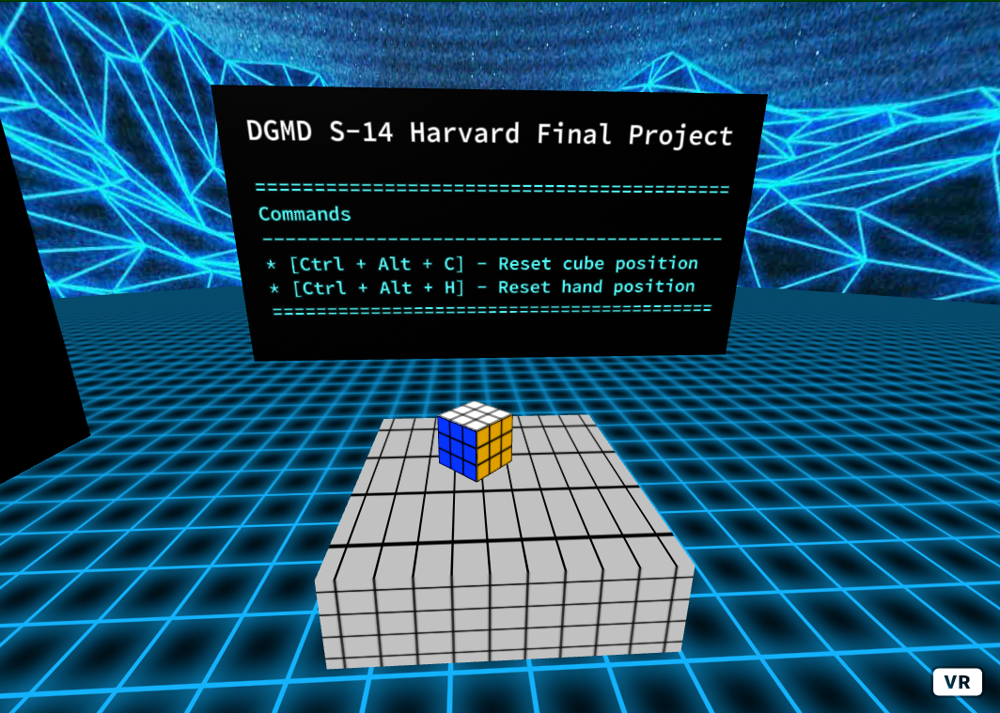

# Virtual Reality

This folder contains all of the code for the VR scene, the physics for all the objects, and the web socket server.

The frameworks and libraries used include:
* A-Frame
* A Node.JS HTTP server

Below is a screenshot of the scene in the browser:




# Running the Scene

To run the VR scene in your browser, run the `server.js` file in your terminal using NodeJS 10+:

```
node server.js
```

It will start the server and run the scene at `http://localhost:55555/`
